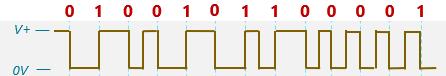
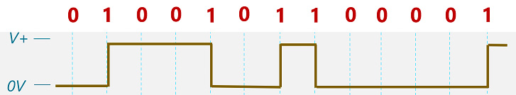

# Week 3 Quiz

1. What component allows ICs to determine whether or not a signal on a data line is a 0, a 1, or undetermined?

    x A/D converter
    ? Comparator

2. How can poor DC balance deteriorate the accuracy of a level slicer?

    a. The imbalance in voltage leads to increased loss, causing false zero readings

    xb. Poor DC balance increases thermal noise, causing errors in level detection

        > Poor DC voltage doesn't itself lead to any increases in temperature or noise arising thereof. 

    c. The imbalance in voltage causes shifting of the thresholds of the level slicer, causing it to become biased.

    d. Poor DC balance decreases the number of bit transitions, making it more difficult to keep clocks on either side of the connection in sync.

3. Why is it important that a synchronous encoding scheme NOT have a long and continuous string of 0s transmitted over the data line?
   
    [] Long sequences of 1's or 0's indicate an inefficient encoding scheme that could leverage compression to improve throughput

        > On the contrary - efficient encoding schemes would leverage every possible bit combination, including long strings of 1's and 0's.

    [x] Long transitions of 1's or 0's can lead to biasing of the level shifter

        > Repeated sequences of 1's or 0's can introduce bias in level detection circuitry.

    [] Long sequences can lead to poor galvanic isolation

        > Galvanic isolation is a property of the physical circuit, as opposed to what is transmitted across it.

    [x] Without transitions to re-align, clocks on either side of the connection drift out of sync.

        > Correct. Bit transitions are used in many encoding implementations to keep clocks in sync.

4. What is the maximum number of 0's that can occur in an continuous span within an encoded binary string that was encoded using 4B/5B?

    a. Three

    xb. Four or Five, depending on the configuration

        > 4B/5B is a specific encoding scheme that is not configurable.

    c. Two

    d. zero

5. Convert the data `0000 00001 0011 0011 0111` into the appropriate 4B5B encoding that would be sent over the wire.

    a. `0000 0001 0011 0011 0111`

    b. `11110 01001 01010 10101 01111`

    **(c)**. `11110 01001 10101 10101 01111`

        > Correct! 4B/5B translates each codeword, then joins them together into a single string.

    d. `11101 11100 11010 11010 10010`

6. What is baudrate and how does it differ from bitrate?

    a. Bitrate is the rate at which bit-encoded symbols are sent over a communication channel. Buadrate is the rate at which individual bits (bauds) are sent.

    b. Baudrate is how fast voltage changes per unit time, while bitrate is the rate at which bits are sent over a connection.

    **(c)**. Baudrate is the rate at which symbols are sent over a communication channel. Bitrate is the rate at which bits are sent over a communication channel.

        > Correct! "Bauds" are symbols, so baudrate is the rate at which entire symbols are sent over a connection. You can convert baudrate to bitrate if you know the number of bits per symbol.

    d. Baudrate is how fast the "body" of the circuit undergoes some physical change.

7. Refer to the image below

    

    It shows the signal sent over the wire and the intended data to be transferred displayed underneath the waveform. Which encoding scheme is being used to encode this data? 

    a. Manchester Encoding

    b. NRZ

    xc. Differential Manchester

        > Different Manchester transitions depending on the previous bit, not on the absolute value of the bit. 

    d. NRZI

    e. Pseudoternary

    f. Bipolar AMI

8. Refer to the image below

    

    It shows the signal sent over the wire and the intended data to be transferred displayed underneath the waveform. Which encoding scheme is being used to encode this data?

    xa. Pseudoternary

        > Pseudoternary has three levels for voltages so you'd see three voltage levels in this encoding if it were Pseudoternary.

    b. NRZ

    c. NRZI

    d. Manchester Encoding

    e. Bipolar AMI

    f. Differential Manchester

9. Name an advantage of Manchester encoding over NRZI encoding.

    a. Faster sending rate.

    b. Three voltage levels, allowing more bits to be sent per clock.

    xc. Eliminates need for clock synchronization.

        > Clock synchronization is still needed. Manchester just provides a mechanism to make it easier to do.

    d. Improved clock syncrhonization

10. What type of IC does an Arduino use as its main computational unit?

    a. CPU

    b. ASIC

    **(c)**. Microcontroller

        > Yes, the Arduino Uno uses an ATmega328, which is considered a microcontroller.

    d. Breakout Board

    e. FPGA

11. What type of IC would NASA would to use for the Mars Rover, if they want it's hardware circuits to be reprogrammable?

    **(a)**. FPGA

        > Yes - NASA would want it to be field-programmable. With an FPGA we can program its hardware in outer space. 

    b. Microcontroller

    c. CPU

12. What type of memory is often used for the main memory of a laptop nowadays?

    a. Flash memory

    b. SRAM

    **(c)**. DRAM

        > Correct! DRAM is what you want to use when you need several gigabytes of memory, it can lose its contents when powered off, and it can't be super expensive. 

    d. ROM

    e. USB Drive

13. John plans to buy a bunch of CPUs to run his cryptocurrency mining operation. Is John making the optimum processor choice, or is there a different kind of processor that might be better?

    [] No, microcontrollers are probably a better option.

        > No, microcontrollers are typically slow - bad choice for computationally intense work.
    
    [x] No, GPUs are probably a better option.

        > GPUs can offer much more parallelism for crypto mining than CPUs can provide. FPGAs would also have been an acceptable answer, as they allow design of custom circuits to speed up certain operations. 

    [] Yes, CPUs are probably the best option.

        > People do use CPUs for this sort of thing, but there are other technologies that offer better performance tradeoffs. Maybe think about if parallelism would accelerate the computation and if any other technologies could help with that.

    [x] No, FPGAs are probably a better option. 
    
        > FPGAs can accelerate computation, as they allow design of custom circuits to speed up certain operations. GPUs would also have been an acceptable answer, as they can offer much more parallelism for crypto mining than CPUs can provide.

14. How do microcontrollers and CPUs typically differ when it comes to memory and I/O?

    xa. Unlike CPUs, Microcontrollers typically do not make use of traditional memories such as SRAM and DRAM.

    b. Microcontrollers typically have external busses to reach memory and I/O, while CPUs usually have those components on-chip.

    c. CPUs typically have external busses to reach memory and I/O, while microcontrollers usually have those components on-chip.

    d. Microcontrollers typically do not perform I/O to off-chip components.

15. Suppose you wanted to implement a circuit, but just implement one copy of it. Which technology would be best to avoid?

    a. FPGA

    xb. ADCs

        > Analog-to-Digital Converters have a relatively low cost per unit. You can buy existing ICs of these for cheap. No real need to avoid these.

    c. 32-bit

    d. ASIC